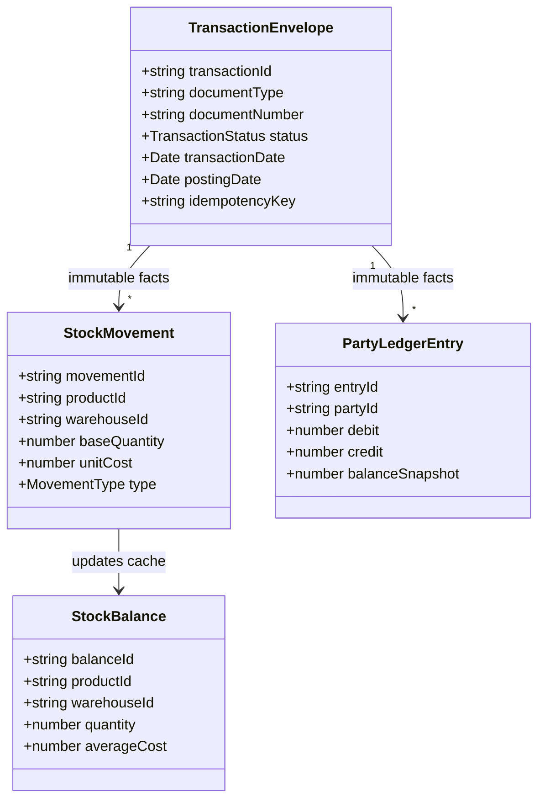

# BillingAnytime Phase 2.1.2 — Production Architecture & Implementation Specification
> **Document Version**: 2.1.2 (Final Pre-Implementation Baseline)  
> **Status**: **APPROVED FOR IMPLEMENTATION**  
> **Target Audience**: Principal Architects, FinTech Engineers, Full-Stack Developers  
> **UI Aesthetic**: SAP Horizon Light (`#F5F7FB` Shell, `#FFFFFF` Surface, `#0070F2` Action Blue, `#15803D` Cash Inflow Green, `#BE123C` Payables Rose)  
> **Non-Negotiables**: Multi-Tenant Isolation, Financial Invariants, Deterministic Money/Decimal Precision, Immutable Posted Ledger Facts, Atomic Audit Events, Concurrency-Safe Sequencing, Server-Side Authoritative Calculations, Zero Ad/Marketing Clutter.

---

# 📑 Table of Contents

1. [Executive Summary](#1-executive-summary)
2. [Phase 1 Existing Foundation](#2-phase-1-existing-foundation)
3. [Architectural Principles & Financial Invariants](#3-architectural-principles--financial-invariants)
4. [Core Domain Model & Entities](#4-core-domain-model--entities)
5. [Module 0: Core Transaction & Financial Integrity Engine](#5-module-0-core-transaction--financial-integrity-engine)
6. [Money & Quantity Precision Strategy](#6-money--quantity-precision-strategy)
7. [Firestore Transaction Boundaries & Atomic Audit Logging](#7-firestore-transaction-boundaries--atomic-audit-logging)
8. [Financial Periods & Backdated Inventory Restriction Policy](#8-financial-periods--backdated-inventory-restriction-policy)
9. [Document Numbering & Concurrency-Safe Sequencing](#9-document-numbering--concurrency-safe-sequencing)
10. [Idempotency & Retry Engine](#10-idempotency--retry-engine)
11. [Audit Logging & Compliance Trail](#11-audit-logging--compliance-trail)
12. [Party Master & Authoritative Ledger Engine](#12-party-master--authoritative-ledger-engine)
13. [Party Pricing Tier Engine](#13-party-pricing-tier-engine)
14. [Item Master & 5-Tab Catalog Management](#14-item-master--5-tab-catalog-management)
15. [Unit Conversion & Canonical Base-Quantity Math](#15-unit-conversion--canonical-base-quantity-math)
16. [Warehouse-Scoped Inventory & Movement Ledger](#16-warehouse-scoped-inventory--movement-ledger)
17. [Warehouse-Scoped Costing (WAC), Sales Return Costing & COGS Engine](#17-warehouse-scoped-costing-wac-sales-return-costing--cogs-engine)
18. [Barcode Generation & Physical Scanner Wedge Engine](#18-barcode-generation--physical-scanner-wedge-engine)
19. [Sales Invoicing Engine (B2B / B2C)](#19-sales-invoicing-engine-b2b--b2c)
20. [Retail POS Counter & Fast-Checkout Engine](#20-retail-pos-counter--fast-checkout-engine)
21. [Purchase Invoicing & Inward Stock Engine](#21-purchase-invoicing--inward-stock-engine)
22. [Payment & Decoupled Allocation Engine](#22-payment--decoupled-allocation-engine)
23. [Cash & Multi-Account Banking Engine](#23-cash--multi-account-banking-engine)
24. [Business Expense & Overhead Tracker](#24-business-expense--overhead-tracker)
25. [Centralized Tax Engine & resolveTaxTreatment()](#25-centralized-tax-engine--resolvetaxtreatment)
26. [GST Input Tax Credit (ITC) & Asset Classification Model](#26-gst-input-tax-credit-itc--asset-classification-model)
27. [GSTR-2B Reconciliation & Purchase Register Hub](#27-gstr-2b-reconciliation--purchase-register-hub)
28. [Operational & Management Reporting Architecture](#28-operational--management-reporting-architecture)
29. [Accounting Scope: Operational Position vs Full Double-Entry](#29-accounting-scope-operational-position-vs-full-double-entry)
30. [Multi-Location & Warehouse Extensibility Foundation](#30-multi-location--warehouse-extensibility-foundation)
31. [Security, Authorization & RBAC Enforcement Matrix](#31-security-authorization--rbac-enforcement-matrix)
32. [Firestore Database Schema & Subcollection Hierarchy](#32-firestore-database-schema--subcollection-hierarchy)
33. [Firestore Composite Index Strategy & Query Constraints](#33-firestore-composite-index-strategy--query-constraints)
34. [API & Domain Service Boundaries](#34-api--domain-service-boundaries)
35. [Comprehensive Test Strategy & Test Scenarios](#35-comprehensive-test-strategy--test-scenarios)
36. [Phase 2 Scope Control (P0, P1, P2, P3 Breakdown)](#36-phase-2-scope-control-p0-p1-p2-p3-breakdown)
37. [Implementation Sequence & Execution Phases](#37-implementation-sequence--execution-phases)

---

# 1. Executive Summary

**BillingAnytime Phase 2.1.2** delivers a commercial-grade, high-integrity Business Operating System. The architecture is engineered specifically for **Retailers, Wholesalers, Distributors, and SMBs**, combining high-speed POS workflows with rigorous financial invariants, decoupled payment allocations, and immutable ledger facts.

---

# 2. Phase 1 Existing Foundation

Phase 1 established the non-negotiable multi-tenant security perimeter and UI design tokens:
- **Authentication**: Firebase Auth with verified custom claims (`orgId`, `role`).
- **RBAC Roles**: `SUPER_ADMIN`, `ADMIN`, `MANAGER`, `SALES`, `PURCHASE`, `WAREHOUSE`.
- **Backend**: Node.js + Express + TypeScript on Firebase Functions structure.
- **Frontend**: React 18 + Vite + TypeScript + Tailwind CSS + Lucide Icons.
- **Design System**: SAP Horizon Light palette (`#F5F7FB` background, `#FFFFFF` cards, `#0070F2` Action Blue).

---

# 3. Architectural Principles & Financial Invariants

### 3.1 Non-Negotiable Invariants
1. **Inventory Conservation Law**:
   $$\text{Closing Stock} = \text{Opening Stock} + \sum \text{Stock Inward Base Qty} - \sum \text{Stock Outward Base Qty}$$
2. **Party Balance Reconstruction Law**:
   $$\text{Party Current Balance} = \text{Opening Balance} + \sum \text{Debit Entries} - \sum \text{Credit Entries}$$
3. **Payment Allocation Invariant**:
   $$\sum \text{Allocated Invoice Amounts} + \text{Unallocated Balance} = \text{Total Payment Voucher Amount}$$
4. **Invoice Financial Invariant**:
   $$\text{Grand Total} = \sum (\text{Line Taxable Amount}) + \text{CGST} + \text{SGST} + \text{IGST} + \text{RoundOff}$$
5. **Cash & Bank Balance Invariant**:
   $$\text{Account Current Balance} = \text{Opening Balance} + \sum \text{Inflows} - \sum \text{Outflows}$$

---

# 4. Core Domain Model & Entities



---

# 5. Module 0: Core Transaction & Financial Integrity Engine

### 5.1 The Transaction Envelope
```typescript
export type TransactionStatus = 'DRAFT' | 'POSTED' | 'CANCELLED' | 'REVERSED';
export type DocumentType = 
  | 'SALE_INVOICE' 
  | 'POS_SALE' 
  | 'QUOTATION' 
  | 'SALE_RETURN' 
  | 'PURCHASE_INVOICE' 
  | 'PURCHASE_RETURN' 
  | 'PAYMENT_IN' 
  | 'PAYMENT_OUT' 
  | 'EXPENSE' 
  | 'STOCK_ADJUSTMENT' 
  | 'STOCK_TRANSFER';

export interface TransactionEnvelope {
  transactionId: string;          // UUID v4
  organizationId: string;         // Verified JWT orgId
  financialPeriodId: string;      // e.g. "FY-2026-27"
  documentType: DocumentType;
  documentNumber: string;         // e.g. "INV-2627-00042"
  transactionDate: string;        // ISO 8601 Business Date
  postingDate: string;            // ISO 8601 System Commit Timestamp
  status: TransactionStatus;
  locationId: string;
  warehouseId: string;
  partyId?: string;
  createdBy: string;
  createdAt: string;
  updatedAt: string;
  idempotencyKey: string;
  reversalOf?: string;            // Original transactionId if reversal
  reversalReason?: string;
}
```

---

# 6. Money & Quantity Precision Strategy

### 6.1 Money Representation (Minor Units / Scaled Integers)
To eliminate IEEE-754 floating-point inaccuracies (e.g. `0.1 + 0.2 = 0.30000000000000004`):
- **Monetary Amounts**: Stored in **Paise (Integer, Scale 100)** where $₹1.00 = 100$.
- **Tax Line Math**: Calculated using `Decimal.js` with explicit `ROUND_HALF_UP` rounding at line level.
- **Unit Cost / WAC**: Stored in **Micro-Paise (Scale 10,000)** (4 decimal places) to eliminate compounding valuation drift.
- **Quantity Precision**: Stored in **the Product's canonical Base Units** with standard 3-decimal fixed precision (Scale 1,000) (e.g., if base unit is `KG`, `2.500 KG` is stored as `2500` scaled base units). *Note: Quantities are expressed directly in the designated base unit, not forcibly converted to grams unless gram is configured as the base unit.*

---

# 7. Firestore Transaction Boundaries & Atomic Audit Logging

### 7.1 Separation of Boundaries
We enforce a strict architecture: **Atomic Firestore Transactions + Application-Level Financial Invariants + Idempotent Domain Commands**.

| Inside Atomic Firestore Transaction | Outside Atomic Transaction (Async / Post-Commit) |
|---|---|
| • Sequence Counter Increment (`documentSequences`) | • Report Aggregate Materialization |
| • Idempotency Lock Acquisition (`idempotencyKeys`) | • Cache Invalidation & Warming |
| • Voucher Document Creation (`saleInvoices`, etc.) | • PDF / Thermal ESC-POS Rendering |
| • Immutable Ledger Writes (`partyLedger`, `stockMovements`) | • WhatsApp / Email Webhooks |
| • Cached Balance Delta Updates (`parties`, `stockBalances`) | • Audit Log Search Projections |
| • **Authoritative Audit Log Write (`auditLogs`)** | |

*Rule: The authoritative audit event for any financial mutation is committed atomically inside the Firestore transaction.*

---

# 8. Financial Periods & Backdated Inventory Restriction Policy

### 8.1 Period Enforcement
- Transactions cannot be posted to a `CLOSED` period (HTTP 403 `PERIOD_CLOSED`).

### 8.2 Backdated Inventory Restriction Policy (Phase 2)
To maintain mathematical determinism and prevent complex historical valuation replay loops:
1. **Rule**: A backdated inventory-affecting transaction (`PURCHASE`, `SALE`, `ADJUSTMENT`) is **permitted only if NO subsequent stock-affecting transaction exists** for that specific item in that warehouse between the requested `transactionDate` and the present time.
2. **If subsequent stock movements exist**: The mutation is rejected with HTTP 400 `BACKDATED_INVENTORY_RESTRICTED`. The user must record the entry on the current date or issue an explicit current-date Stock Adjustment.
3. **Party Ledgers**: Financial-only backdated entries (e.g. non-stock payment receipts) within an `OPEN` period are permitted and sorted by `(transactionDate, postingDate)`.

---

# 9. Document Numbering & Concurrency-Safe Sequencing

### 9.1 Single Atomic Sequence Allocation
- Phase 2 uses **one atomic sequence allocation per posted document** directly inside the Firestore transaction.
- Sequence batching is removed from initial implementation and documented as a future optimization if high POS stress testing warrants it.

```typescript
export interface DocumentSequence {
  id: string;                    // e.g. "FY2627_SALE_INVOICE_MAIN"
  orgId: string;
  financialPeriodId: string;
  documentType: DocumentType;
  prefix: string;                // "INV-2627-"
  currentValue: number;          // Monotonically increasing integer
  paddingLength: number;
  updatedAt: string;
}
```

---

# 10. Idempotency & Retry Engine

### 10.1 Schema (`organizations/{orgId}/idempotencyKeys/{key}`)
```typescript
export interface IdempotencyRecord {
  idempotencyKey: string;
  orgId: string;
  transactionId: string;
  resultRef: string;             // Firestore Document Path (e.g. "saleInvoices/inv_123")
  status: 'IN_PROGRESS' | 'COMMITTED' | 'FAILED';
  requestPayloadHash: string;   // SHA-256 hash
  createdAt: string;
  expiresAt: string;            // 24h TTL
}
```
*Guarantee*: Exactly one logical business transaction is committed for an idempotency key.

---

# 11. Audit Logging & Compliance Trail

```typescript
export interface AuditLog {
  logId: string;
  orgId: string;
  actorUid: string;
  actorEmail: string;
  action: 'POST' | 'CANCEL' | 'REVERSE' | 'ADJUST_STOCK' | 'ROLE_CHANGE';
  entityType: DocumentType | 'PRODUCT' | 'PARTY';
  entityId: string;
  timestamp: string;
  diff?: { before?: any; after?: any };
}
```

---

# 12. Party Master & Authoritative Ledger Engine

### 12.1 Canonical Double-Sided Ledger
- Authoritative Ledger Facts: `debit` (Paise) and `credit` (Paise).
- `balanceSnapshot`: An informational posting cache, **not** the authoritative source of truth.

```typescript
export interface PartyLedgerEntry {
  entryId: string;
  orgId: string;
  partyId: string;
  transactionId: string;
  documentType: DocumentType;
  documentNumber: string;
  date: string;
  debit: number;                 // Positive Integer (Paise)
  credit: number;                // Positive Integer (Paise)
  balanceSnapshot: number;       // Informational cache
  description: string;
  createdBy: string;
  createdAt: string;
}
```

$$\text{Current Balance} = \text{Opening Balance} + \sum \text{Debit} - \sum \text{Credit}$$

---

# 13. Party Pricing Tier Engine

```typescript
export interface PartyPriceRule {
  id: string;
  orgId: string;
  partyId?: string;
  partyCategory?: string;        // e.g. "WHOLESALER"
  productId: string;
  price: number;                 // Custom net price in Paise
  minimumQuantity: number;       // Tier threshold (e.g. >= 10 BOX)
  priceType: 'FIXED' | 'DISCOUNT_PERCENT';
  effectiveFrom: string;
  effectiveTo?: string;
}
```

---

# 14. Item Master & 5-Tab Catalog Management

### 14.1 Product Schema (`organizations/{orgId}/products/{productId}`)
*Note: `stockQty` is strictly a derived/cached display aggregate. Authoritative stock lives in `stockBalances`.*

```typescript
export interface Product {
  id: string;
  orgId: string;
  itemType: 'PRODUCT' | 'SERVICE';
  name: string;
  sku: string;
  barcode: string;
  additionalBarcodes?: string[];
  hsnCode: string;
  categoryId: string;
  baseUnitId: string;            // e.g. "PCS"
  baseUnitSymbol: string;
  purchaseCost: number;          // Default cost (Paise)
  salePrice: number;             // Default selling price (Paise)
  mrp: number;                   // MRP (Paise)
  isTaxInclusive: boolean;
  taxRate: 0 | 5 | 12 | 18 | 28;
  trackInventory: boolean;
  reorderLevel: number;          // Base units threshold
  status: 'ACTIVE' | 'INACTIVE';
  createdAt: string;
  updatedAt: string;
}
```

---

# 15. Unit Conversion & Canonical Base-Quantity Math

```typescript
export interface UnitConversion {
  id: string;
  orgId: string;
  productId?: string;
  fromUnit: string;              // "BOX"
  toBaseUnit: string;            // "PCS"
  multiplier: number;            // 24 (1 BOX = 24 PCS)
  precision: number;
}
```
$$\text{Base Quantity} = \text{Input Quantity} \times \text{Multiplier}$$

---

# 16. Warehouse-Scoped Inventory & Movement Ledger

### 16.1 Authoritative Stock Balance (`organizations/{orgId}/stockBalances/{balanceId}`)
```typescript
export interface StockBalance {
  id: string;                    // `${orgId}_${locId}_${whId}_${productId}`
  orgId: string;
  locationId: string;
  warehouseId: string;
  productId: string;
  quantity: number;              // Authoritative on-hand (Base Units)
  averageCost: number;           // Authoritative WAC in Micro-Paise
  updatedAt: string;
}
```

### 16.2 Movement Ledger (`organizations/{orgId}/stockMovements/{movementId}`)
```typescript
export interface StockMovement {
  movementId: string;
  orgId: string;
  locationId: string;
  warehouseId: string;
  productId: string;
  movementType: StockMovementType;
  referenceType: DocumentType;
  referenceId: string;
  referenceNumber: string;
  baseQuantity: number;          // Signed Integer: Positive (In), Negative (Out)
  unitCost: number;              // Micro-Paise at time of movement
  totalValuation: number;        // abs(baseQuantity) * unitCost
  balanceSnapshot: number;       // Informational cache
  occurredAt: string;
  createdBy: string;
}
```

---

# 17. Warehouse-Scoped Costing (WAC), Sales Return Costing & COGS Engine

### 17.1 WAC Recalculation Rules
- **Purchase Inward**:
  $$\text{New WAC} = \frac{(\text{Current Qty} \times \text{Current WAC}) + (\text{Inward Qty} \times \text{Effective Purchase Cost})}{\text{Current Qty} + \text{Inward Qty}}$$
- **Sale / Purchase Return**: Leaves WAC unit cost unchanged; reduces stock at current WAC.
- **Sales Return Costing**:
  - **Linked Returns**: For sales returns linked to an original invoice, the system **reverses the original sale's recorded COGS / unit cost**.
  - **Unlinked / Manual Returns**: Evaluated at the **current warehouse WAC**.
- **Authoritative COGS Formula**:
  $$\text{COGS} = \sum \text{Outward Sales Cost} - \sum \text{Sales Return Cost} + \sum \text{Stock Loss / Write-Off Cost}$$

---

# 18. Barcode Generation & Physical Scanner Wedge Engine

- **Internal EAN-13**: Generated with standard Modulo-10 checksum using internal prefix `200`–`299`.
- **Keyboard Wedge Buffer**: Detects bursts $<80\text{ms}$ terminating in `Enter` to trigger instant line-item addition.

---

# 19. Sales Invoicing Engine (B2B / B2C)

- Invoice amounts (`amountReceived`, `balanceDue`, `paymentStatus`) are **derived from payment allocations**.

---

# 20. Retail POS Counter & Fast-Checkout Engine

- Fast tender keys (`Exact`, `+₹100`, `+₹500`), change calculator, and 58mm/80mm thermal ESC/POS printing.

---

# 21. Purchase Invoicing & Inward Stock Engine

- Mandatory `originalVendorBillNo` and `originalVendorBillDate` for GST compliance.

---

# 22. Payment & Decoupled Allocation Engine

### 22.1 Payment Allocations Schema (`organizations/{orgId}/paymentAllocations/{allocId}`)
```typescript
export interface PaymentAllocation {
  id: string;
  orgId: string;
  paymentId: string;
  invoiceId: string;
  invoiceType: 'SALE_INVOICE' | 'PURCHASE_INVOICE';
  allocatedAmount: number;       // Paise
  allocatedAt: string;
}
```
$$\text{Invoice Balance Due} = \text{Invoice Grand Total} - \sum \text{Allocated Amounts}$$

---

# 23. Cash & Multi-Account Banking Engine

- Multi-account management: Cash Drawer, Bank Accounts, UPI QRs, and Contra Transfer vouchers.

---

# 24. Business Expense & Overhead Tracker

- Categorized direct and indirect overhead tracking with GST ITC claim eligibility flags.

---

# 25. Centralized Tax Engine & resolveTaxTreatment()

```typescript
export interface TaxContext {
  supplierLocation: { stateCode: string; gstin?: string; isSez: boolean };
  recipientLocation: { stateCode: string; gstin?: string; registrationType: 'REGULAR' | 'COMPOSITION' | 'UNREGISTERED' | 'OVERSEAS' };
  placeOfSupply: string;         // 2-digit State Code
  supplyType: 'B2B' | 'B2C_LARGE' | 'B2C_SMALL' | 'EXPORT_WITH_TAX' | 'EXPORT_WITHOUT_TAX' | 'SEZ';
  isReverseCharge: boolean;
  taxableValue: number;          // Paise
  gstRate: number;               // 0, 5, 12, 18, 28
}

export function resolveTaxTreatment(ctx: TaxContext) {
  const isIntraState = ctx.supplierLocation.stateCode === ctx.placeOfSupply && !ctx.supplierLocation.isSez;
  const rawTax = Math.round((ctx.taxableValue * ctx.gstRate) / 100);

  if (isIntraState) {
    const halfTax = Math.round(rawTax / 2);
    return { isIntraState: true, cgstAmount: halfTax, sgstAmount: halfTax, igstAmount: 0, totalTax: halfTax * 2 };
  } else {
    return { isIntraState: false, cgstAmount: 0, sgstAmount: 0, igstAmount: rawTax, totalTax: rawTax };
  }
}
```

---

# 26. GST Input Tax Credit (ITC) & Asset Classification Model

### 26.1 Asset Classification (What it is)
- `TRADING_STOCK`, `RAW_MATERIAL`, `INPUT_SERVICE`, `CAPITAL_GOOD`, `EXPENSE`.

### 26.2 ITC Eligibility Status (How it is claimed)
- `ELIGIBLE`, `BLOCKED_17_5`, `TIME_BARRED`, `POS_RESTRICTED`, `RCM`, `REVERSED`, `PENDING_RECONCILIATION`.

---

# 27. GSTR-2B Reconciliation & Purchase Register Hub

- Compares local `purchaseInvoices` against imported GSTR-2B JSON data to categorize: `MATCHED`, `MISSING_IN_PORTAL`, `TAX_MISMATCH`, `GSTIN_MISMATCH`.

---

# 28. Operational & Management Reporting Architecture

Reports are derived from **Ledgers and Movements**:
- **Financial Position Snapshot (Management)** (formerly Balance Sheet)
- **Operational Revenue & Profit Statement (Management)** (formerly Operational P&L)
- **Stock Detail Movement Ledger**
- **Receivable Ageing (30/60/90 Days)**
- **GSTR-1 & GSTR-3B Preparation Summaries**

---

# 29. Accounting Scope: Operational Position vs Full Double-Entry

### 29.1 Phase 2 Accounting-Ready Foundation
- **Phase 2 Implementation**: Operational ERP Accounting (Party Dr/Cr ledgers, Bank/Cash Accounts, Warehouse WAC COGS, Operational Profit, Tax Registers).
- **Extensibility Guarantee**: All Phase 2 transaction effects (`saleInvoices`, `purchaseInvoices`, `payments`, `stockMovements`) are structured as **Accounting-Ready Event Streams**. A future Phase 3 General Ledger engine can map these effects directly into formal Double-Entry Journal Entries (`JV`) without modifying or rewriting the Sales, Purchase, Inventory, or Payment engines.

---

# 30. Multi-Location & Warehouse Extensibility Foundation

- Enforces `locationId` and `warehouseId` across all stock movements and document envelopes.

---

# 31. Security, Authorization & RBAC Enforcement Matrix

- Server-side authorization verified on all routes: `SUPER_ADMIN`, `ADMIN`, `MANAGER`, `SALES`, `PURCHASE`, `WAREHOUSE`.

---

# 32. Firestore Database Schema & Subcollection Hierarchy

Root: `organizations/{orgId}/`
- `financialPeriods/{periodId}`
- `documentSequences/{seriesKey}`
- `idempotencyKeys/{key}`
- `auditLogs/{logId}`
- `parties/{partyId}` & `partyLedger/{entryId}`
- `partyPriceRules/{ruleId}`
- `products/{productId}` & `stockBalances/{balanceId}`
- `unitConversions/{conversionId}`
- `stockMovements/{movementId}`
- `saleInvoices/{invoiceId}` & `quotations/{quotationId}`
- `purchaseInvoices/{invoiceId}`
- `payments/{paymentId}` & `paymentAllocations/{allocId}`
- `bankAccounts/{accountId}` & `contraTransfers/{transferId}`
- `expenses/{expenseId}`

---

# 33. Firestore Composite Index Strategy & Query Constraints

Configured in `firestore.indexes.json` for `saleInvoices`, `stockMovements`, `partyLedger`, and `products`.

---

# 34. API & Domain Service Boundaries

- Clean domain modules under `backend/src/modules/` (`sequence`, `tax`, `parties`, `inventory`, `sales`, `purchases`, `payments`, `accounting`, `reports`).

---

# 35. Comprehensive Test Strategy & Test Scenarios

- Unit tests for deterministic Money math, Tax Treatment, WAC calculation, and FIFO allocation.
- Atomic Firestore transaction integration tests.

---

# 36. Phase 2 Scope Control (P0, P1, P2, P3 Breakdown)

- **P0**: Core transaction engine, single atomic sequence allocation, party ledger, 5-tab items & stock balance, sales/POS, purchases, cash/bank, **Basic Payment In/Out & direct invoice allocation**.
- **P1**: Quotations, Advanced FIFO multi-invoice auto-allotment & cash discounts received, Debit/Credit notes, EAN-13 barcodes, GSTR-1/3B.
- **P2**: GSTR-2B JSON import reconciliation, 30/60/90 aging, multi-unit conversions.
- **P3**: Full Double-Entry General Ledger (`JV`), Manufacturing BOM, E-Way Bill auto-sync.

---

# 37. Implementation Sequence & Execution Phases

- **Phase 2A**: Foundations & Core Engine (`TransactionEnvelope`, `idempotencyKeys`, `documentSequences`, `partyLedger`, `products`, `stockBalances`, `stockMovements`, basic payments).
- **Phase 2B**: Sales & POS Billing (`saleInvoices`, POS Fast Checkout, `quotations`).
- **Phase 2C**: Purchases & Vendor Settlements (`purchaseInvoices`, `paymentAllocations`, debit notes).
- **Phase 2D**: Multi-Account Banking & Expenses (`bankAccounts`, `contraTransfers`, `expenses`).
- **Phase 2E**: Tax Engine & GSTR-2B Reconciliation.
- **Phase 2F**: Operational & Management Reports.
- **Phase 2G**: Invariant Test Suite, Concurrency Verification, and Production Deployment.
