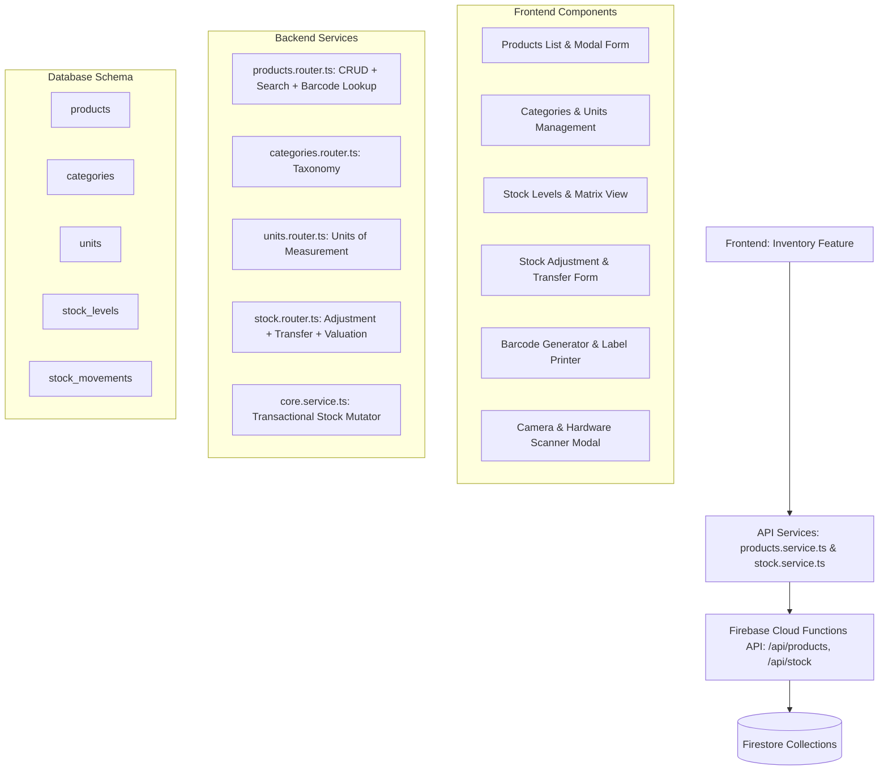

# 📦 BizOps — Phase 2: Inventory Management & Barcode Engine

> **Module Goal**: Deliver an enterprise-grade, high-performance Inventory Management system with multi-warehouse tracking, real-time stock ledger, HSN & GST compliance, automated barcode generation (EAN-13 & Code128), thermal/A4 label printing, and live camera + USB barcode scanning.

---

## 🎯 Phase 2 Objectives

1. **Product Master Management**: Complete CRUD for products with HSN code, GST slabs (0%, 5%, 12%, 18%, 28%), purchase/selling prices, MRP, profit margin calculation, and multi-barcode support.
2. **Category & Unit Taxonomy**: Hierarchical category tree, measurement units (PCS, KGS, MTR, BOX, LTR, etc.) with symbols and decimal precision.
3. **Multi-Warehouse Stock Engine**: Real-time stock tracking per warehouse/branch with ACID transactional updates, preventing negative stock and race conditions.
4. **Stock Adjustments & Transfers**: Physical inventory count reconciliation, damage/loss write-offs, opening balance entry, and inter-warehouse stock transfer.
5. **Stock Movement Ledger (Audit Trail)**: Immutable event log of every inventory delta (`PURCHASE`, `SALE`, `RETURN`, `ADJUSTMENT`, `TRANSFER`, `OPENING`) with running balances.
6. **Barcode System**:
   - **Generation**: Auto-generate valid EAN-13 (with checksum) and Code128 barcodes.
   - **Label Printing**: Printable thermal stickers (50x25mm, 50x38mm) and A4 label sheets (24/40 labels per page).
   - **Scanning**: Hardware USB/Bluetooth scanner wedge listener + Live camera barcode scanner (video stream via WebRTC/ZXing).
7. **Low Stock & Reorder Alerts**: Real-time indicators and notification triggers when stock drops below configured safety levels.

---

## 🏛️ Architecture & Component Breakdown



---

## 🗄️ Data Model & Firestore Schema

### 1. `products` Collection
```typescript
interface Product {
  id: string                    // Firestore Doc ID
  orgId: string                 // Tenant ID
  name: string                  // Product Title
  sku: string                   // Unique SKU code
  description?: string
  categoryId?: string           // Reference to categories
  categoryName?: string         // Denormalized for fast display
  unitId: string                // Reference to units (e.g., PCS)
  unitSymbol: string            // Denormalized (e.g., "pcs")
  hsnCode?: string              // 4, 6, or 8 digit HSN/SAC
  purchasePrice: number         // Cost price (excl. tax or incl.)
  salePrice: number             // Selling price (base)
  mrp: number                   // Maximum Retail Price
  taxRate: 0 | 5 | 12 | 18 | 28 // GST %
  isTaxable: boolean
  isTaxInclusive: boolean       // Whether salePrice includes GST
  trackInventory: boolean       // Enable/disable stock tracking
  reorderLevel: number          // Low stock alert threshold
  barcodes: {
    value: string               // Barcode string
    type: 'EAN13' | 'CODE128' | 'QR'
    isPrimary: boolean
  }[]
  images?: string[]             // Firebase Storage URLs
  status: 'ACTIVE' | 'INACTIVE'
  createdBy: string
  createdAt: string
  updatedAt: string
}
```

### 2. `categories` & `units` Collections
```typescript
interface Category {
  id: string
  orgId: string
  name: string
  parentId?: string
  description?: string
  status: 'ACTIVE' | 'INACTIVE'
  createdAt: string
}

interface Unit {
  id: string
  orgId: string
  name: string                 // "Pieces", "Kilograms", "Meters"
  symbol: string               // "PCS", "KG", "MTR"
  precision: number            // 0 for PCS, 2 or 3 for KG
  isDefault?: boolean
  createdAt: string
}
```

### 3. `stock_levels` Collection
*Document ID: `{productId}_{warehouseId}` or indexed by `[orgId, productId, warehouseId]`*
```typescript
interface StockLevel {
  id: string
  orgId: string
  productId: string
  productName: string
  sku: string
  branchId: string
  warehouseId: string
  warehouseName: string
  quantityOnHand: number
  reorderLevel: number
  reservedQuantity: number     // Stock in pending orders/quotes
  lastUpdated: string
}
```

### 4. `stock_movements` Collection (Immutable Ledger)
```typescript
interface StockMovement {
  id: string
  orgId: string
  productId: string
  productName: string
  sku: string
  branchId?: string
  warehouseId: string
  type: 'PURCHASE' | 'SALE' | 'RETURN' | 'ADJUSTMENT' | 'TRANSFER' | 'OPENING'
  referenceType?: 'INVOICE' | 'PURCHASE_ORDER' | 'ADJUSTMENT_DOC' | 'TRANSFER_DOC'
  referenceId?: string
  quantity: number             // Positive for IN, negative for OUT
  unitCost?: number            // Cost at movement time
  balanceAfter: number         // Resulting stock level
  reason?: 'PHYSICAL_COUNT' | 'DAMAGED' | 'EXPIRED' | 'THEFT' | 'CORRECTION' | 'INITIAL'
  note?: string
  createdBy: string
  userName: string
  createdAt: string
}
```

---

## 🛠️ Step-by-Step Implementation Roadmap

### Phase 2.1: Backend API Endpoints & Core Logic
- [ ] **Products Router (`backend/src/modules/products/products.router.ts`)**:
  - `GET /api/products`: Filterable by category, status, search query (name/sku/barcode), with pagination.
  - `GET /api/products/:id`: Fetch single product with current stock breakdown across warehouses.
  - `POST /api/products`: Create product, auto-generate SKU/Barcode if empty, initialize opening stock if provided.
  - `PUT /api/products/:id`: Update details and tax/pricing.
  - `DELETE /api/products/:id`: Soft delete / archive product.
  - `GET /api/products/lookup/barcode/:barcode`: Quick lookup for POS/billing scanner.
- [ ] **Categories & Units Routers**:
  - `backend/src/modules/products/categories.router.ts` (CRUD)
  - `backend/src/modules/products/units.router.ts` (CRUD with standard seed defaults)
- [ ] **Stock Management Router (`backend/src/modules/stock/stock.router.ts`)**:
  - `GET /api/stock`: Summary matrix of all products with stock per warehouse.
  - `POST /api/stock/adjustments`: Atomic stock adjustment with reason and audit trail.
  - `POST /api/stock/transfers`: Inter-warehouse transfer with source subtraction & destination addition in one transaction.
  - `GET /api/stock/movements`: Filterable stock movement timeline.
  - `GET /api/stock/low-stock`: Products falling below reorder thresholds.
- [ ] **Mount Routers in `backend/src/app.ts`** and register Firestore security rules.

---

### Phase 2.2: Barcode Engine & Label Printing
- [ ] **Barcode Utilities (`frontend/src/lib/barcode.ts`)**:
  - EAN-13 generator with valid Modulo-10 checksum calculator.
  - Code-128 auto-generation utility.
  - Barcode SVG/Canvas renderer (using `jsbarcode` / pure SVG generator).
- [ ] **Thermal & A4 Print Engine (`BarcodePrintModal.tsx`)**:
  - Dynamic label preview with price, MRP, Org Name, Product Title, Barcode.
  - Support for Standard Thermal Roll (50mm x 25mm, 50mm x 38mm) & A4 sticker sheets (24-up, 40-up, 65-up).
  - Print CSS stylesheets for pixel-perfect label alignment.
- [ ] **Barcode Scanner Engine**:
  - **Hardware Scanner Hook (`useBarcodeScanner.ts`)**: Global keydown listener detecting rapid keystroke bursts (<50ms between keys + Enter) from USB/Bluetooth handheld scanners.
  - **Live Camera Scanner Modal (`CameraScannerModal.tsx`)**: Mobile/Webcam barcode scanning using HTML5 video stream.

---

### Phase 2.3: Frontend UI & User Experience
- [ ] **Products Management (`/inventory/products`)**:
  - `ProductsPage.tsx`: High-contrast dark glassmorphic table with search, SKU, Category, Stock status badge, Selling Price, Tax slab, and action menu.
  - `ProductFormModal.tsx` (Add & Edit): Interactive form with margin calculation (`(SalePrice - PurchasePrice) / PurchasePrice * 100`), auto-barcode generation, and initial stock by warehouse.
  - `ProductDetailModal.tsx`: Product overview, stock per branch/warehouse, recent movements.
- [ ] **Taxonomy Management**:
  - `CategoriesPage.tsx` (`/inventory/categories`): Visual category list with product count and add/edit modal.
  - `UnitsPage.tsx` (`/inventory/units`): Unit list with symbol and precision tags.
- [ ] **Stock Levels & Valuation (`/inventory/stock`)**:
  - `StockLevelsPage.tsx`: Product stock grid across multiple warehouses, low-stock filter, total inventory valuation (Cost Value vs. Retail Value).
- [ ] **Stock Adjustments & Audit Ledger**:
  - `StockAdjustmentsPage.tsx` (`/inventory/adjustments`): History of stock corrections and discrepancies.
  - `NewAdjustmentModal.tsx`: Multi-item stock adjustment form with reason picker (Damaged, Expired, Physical Count Mismatch, etc.).
  - `StockMovementsPage.tsx` (`/inventory/movements`): Full chronological ledger of every stock transaction.
- [ ] **Route Setup & Sidebar Updates**:
  - Wire up all real components in `frontend/src/routes/index.tsx`.
  - Ensure navigation badges reflect real-time low-stock counts.

---

## 🧪 Verification & Acceptance Criteria

| Area | Criteria | Verification Method |
|---|---|---|
| **Product CRUD** | Can create, update, search, filter, and archive products with multi-tax slabs | UI test + Backend API test |
| **Barcode Generation** | EAN-13 barcodes generated pass standard checksum verification | Unit test / Scanner test |
| **Barcode Printing** | Generates clean thermal 50x25mm and A4 multi-label sheets | Browser Print Preview |
| **Hardware Scanner** | USB wedge scanner triggers instant product selection in <100ms | Keystroke simulation test |
| **Stock Ledger ACID** | Stock adjustments never produce negative values unless allowed; updates both `stock_levels` and `stock_movements` in 1 transaction | Concurrency API test |
| **Inter-Warehouse Transfer** | Deducts from Source warehouse and increments Destination warehouse atomically | Transactional test |
| **Type Safety & Build** | `tsc --noEmit` and `npm run build` pass with 0 errors across frontend and backend | Automated build verification |

---

## 📅 Execution Schedule

1. **Sprint 1 (Day 1)**: Backend Product, Category, Unit, and Stock APIs + Firestore ACID transactions.
2. **Sprint 2 (Day 2)**: Barcode Generator, Thermal/A4 Label Print engine, and Hardware/Camera Scanner modules.
3. **Sprint 3 (Day 3)**: Frontend Product Master, Category/Unit management, and Stock Matrix UI pages.
4. **Sprint 4 (Day 4)**: Stock Adjustments, Inter-Warehouse Transfers, Stock Movement Ledger, and Full End-to-End verification.
