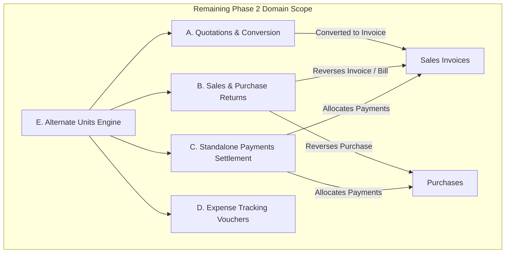

# BillingAnytime — Phase 2 Remaining Scope Master Implementation Plan

> **Document Version:** v2.2.0-REMAINING  
> **Status:** APPROVED ARCHITECTURAL BASELINE FOR REMAINING PHASE 2  
> **Scope:** Remaining 5 Sub-Modules of Phase 2 only (Quotations, Returns, Standalone Payments, Expenses, Alternate Units)  
> **Methodology:** Repository Audit First, Zero Floating-Point Precision, Server-Authoritative, Atomic Firestore Transactions, Non-Negative Stock, Double-Sided Ledger Invariants.

---

## 1. Executive Summary

BillingAnytime has successfully completed and verified the core architectural backbone of Phase 2:
- **Paise-Precision Financial Engine:** Integer Paise (Scale 100), Micro-Paise (Scale 10,000) for inventory valuation, and Scaled Base Units (Scale 1,000).
- **Tax Engine:** Deterministic Indian GST evaluation (CGST/SGST/IGST, Place of Supply, reverse calculation for tax-inclusive items).
- **Core Operations:** Customers & Suppliers with double-sided Dr/Cr ledger, 5-Tab product catalog with EAN-13 barcode generation, atomic Sales & fast POS checkout, inward Purchase Bills with Weighted Average Cost (WAC) recalculation, and Google Authentication.

This document details the architectural specifications, transaction boundaries, data contracts, and UI blueprints for the **remaining 5 Phase 2 commercial workflows**:
1. **Quotations / Estimates & Proforma Invoices** (`/sales/quotations`)
2. **Sales Returns & Purchase Returns (Credit / Debit Notes)** (`/sales/returns`, `/purchases/returns`)
3. **Standalone Payment In & Payment Out with FIFO Settlement** (`/payments/received`, `/payments/made`)
4. **Operating Expense Vouchers (GL-Ready)** (`/purchases/expenses`)
5. **Alternate Units & Multi-Unit Conversion Engine** (e.g. $1\text{ Box} = 24\text{ PCS}$)

---

## 2. Current Phase 2 Status & Repository Audit Findings

Based on inspection of active code in `/Users/shaikhoology/billing`:

| Component / Feature Area | Codebase Status | Audit Findings & Current Gaps |
| :--- | :---: | :--- |
| **Monetary & Math Utilities** (`utils/money.ts`) | ✅ COMPLETE | Scaled Paise, Micro-Paise, and Scaled Quantity conversions verified with 11 invariant tests. |
| **Tax Engine** (`modules/tax/tax.engine.ts`) | ✅ COMPLETE | Intra-State, Inter-State, Export, and Tax-Inclusive reverse calculations operational. |
| **Document Sequences** (`modules/sequence/`) | ✅ COMPLETE | Concurrency-safe monotonic allocations inside active Firestore transactions. |
| **Fiscal Periods** (`modules/periods/`) | ✅ COMPLETE | Indian Fiscal Year (`FY-YYYY-YY`) derivation and closed-period write rejection. |
| **Audit Service** (`modules/audit/`) | ✅ COMPLETE | Atomic transaction logging of entity state diffs. |
| **Idempotency** (`middleware/idempotency.middleware.ts`) | ✅ COMPLETE | SHA-256 request payload hashing and cached replay. |
| **Parties & Ledger** (`modules/parties/`) | ✅ COMPLETE | Party 360 statement, GSTIN extraction, and atomic Dr/Cr posting. |
| **Inventory Catalog** (`modules/inventory/`) | ✅ COMPLETE | 5-Tab modal, EAN-13 generation, warehouse stock balances, and physical stock adjustment. |
| **Sales Invoicing & Fast POS** (`modules/sales/`) | ✅ COMPLETE | Fast POS lane, barcode wedge listener, line item tax calculation, stock reduction, and receipt printing. |
| **Inward Purchases** (`modules/purchases/`) | ✅ COMPLETE | Vendor bill entry, supplier payable posting, and WAC arithmetic. |
| **A. Quotations & Conversion** (`/sales/quotations`) | 🟡 PARTIAL | Backend supports `docType: 'QUOTATION'`, but missing lifecycle status (`DRAFT`, `CONVERTED`, `EXPIRED`), conversion endpoint, duplicate prevention, and frontend UI. |
| **B. Sales & Purchase Returns** (`/sales/returns`, `/purchases/returns`) | 🔴 NOT IMPLEMENTED | Types declared; missing dedicated return controllers, original bill lookup, returnable quantity validation, historical COGS reversal, and UI. |
| **C. Standalone Payments** (`/payments/received`, `/payments/made`) | 🟡 PARTIAL | Basic `PaymentsService.recordPayment` exists in backend, but lacks multi-invoice FIFO allocation resolver, invoice document `paidAmount` updates, and frontend UI. |
| **D. Expense Vouchers** (`/purchases/expenses`) | 🔴 NOT IMPLEMENTED | Type `'EXPENSE'` declared; no service, controller, category schema, or UI exists. |
| **E. Alternate Units** (`inventory/units`) | 🔴 NOT IMPLEMENTED | `UnitConversion` type exists; no conversion calculation in line items, price-per-unit selection, or barcode unit lookup. |

---

## 3. Detailed Scope for Remaining Phase 2 Modules



---

## 4. Architectural Specifications & Hardened Backend Contracts

### 4.1 Hardened Financial & Domain Rules (Phase 2.2.1 Compliance)

#### 1. Deterministic Alternate Unit Semantics
- Do **NOT** use unrestricted floating-point multipliers.
- Every conversion rule defines an exact rational ratio:
  ```typescript
  conversionNumerator: number;   // e.g. 24 (Number of base units)
  conversionDenominator: number; // e.g. 1 (Number of secondary units)
  ```
- **Authoritative Base Quantity Arithmetic**:
  $$Q_{\text{base (scaled 1000)}} = \text{round}\left( \frac{Q_{\text{entered (scaled 1000)}} \times \text{conversionNumerator}}{\text{conversionDenominator}} \right)$$
- **Price Conversion Arithmetic**:
  $$\text{Unit Rate}_{\text{entered (Paise)}} = \text{round}\left( \frac{\text{Unit Rate}_{\text{base (Paise)}} \times \text{conversionNumerator}}{\text{conversionDenominator}} \right)$$
- **Base Unit Truth**: All database stock balances (`StockBalance`) and inventory movements (`StockMovement`) strictly store integer $Q_{\text{base}}$ at Scale 1,000.

#### 2. Return + Payment Interaction & Explicit Party Credit Balance
- When an invoice is paid (e.g. ₹10,000) and subsequently returned (e.g. ₹3,000):
  - Document Outstanding (`balanceDuePaise`) remains ₹0 (never negative).
  - The Credit Note generates a Credit entry on the Customer's Party Ledger of ₹3,000.
  - The Customer's authoritative balance decreases by ₹3,000 (or increases unallocated advance/credit).
  - Document balance due is **never** stored as negative. All credits flow to the Party Account.
- Similarly, a Purchase Return against a paid vendor bill generates a Debit entry on the Supplier Ledger, creating an explicit supplier debit note/advance balance.

#### 3. Payment + Cash Discount Semantics
- Settlement equation:
  $$\text{settlementAmountPaise} = \text{paymentAmountPaise} + \text{discountPaise}$$
  $$\sum \text{allocatedAmountPaise} \le \text{settlementAmountPaise}$$
- Cash discount is a settlement adjustment, **not** additional cash received/paid.
- The discount allowed cannot exceed the eligible outstanding balance of the target invoice.

#### 4. Sales Return Accounting & Historical COGS Reversal
- The economic flow is:
  $$\text{Sales Return} \rightarrow \text{Revenue reversal} \rightarrow \text{Tax reversal} \rightarrow \text{Receivable reversal} \rightarrow \text{Inventory restoration at historical sale cost} \rightarrow \text{Historical COGS reversal}$$
- Reversal uses the original sale line's recorded `costPriceMicroPaise`.
- Full-line return: Reversal exactly matches the original recorded line economics.
- Partial return: Reversal proportionally allocates taxable amount, CGST, SGST, IGST, and COGS without fractional drift.

#### 5. Deterministic Tax Reversal
- For full-line returns: $\text{Returned Tax} \equiv \text{Original Recorded Line Tax}$.
- For partial returns: $\text{Returned Tax} = \text{round}\left( \frac{Q_{\text{return}}}{Q_{\text{orig}}} \times \text{Original Recorded Tax} \right)$, ensuring no tax discrepancy over multiple partial returns.

#### 6. Quotation Conversion Snapshot Invariant
- Quotation conversion uses the **immutable commercial snapshot** stored on the quotation (product, quoted rate, line discount, tax configuration). It never silently replaces quoted prices with current catalog prices.
- At conversion time, the transaction revalidates stock, fiscal period status, customer status, and the conversion lock (`convertedToInvoiceId`) to guarantee atomic, single-execution conversion.

#### 7. FIFO Determinism
- Auto-allocation orders unpaid invoices deterministically:
  $$\text{ORDER BY } \text{transactionDate ASC}, \text{documentNumber ASC}, \text{transactionId ASC}$$
- Excludes cancelled, draft, or fully settled documents.

#### 8. Expense / General Ledger Boundary
- Phase 2 records GL-compatible metadata (category, vendor, taxable amount, tax breakdown, ITC eligibility, payment mode, reference) without implementing Phase 3 General Ledger charts prematurely.

---

### 4.2 Module E: Alternate Units & Multi-Unit Conversion Engine Schema

```typescript
export interface UnitConversionRule {
  id: string;                    // `${orgId}_${productId || 'GLOBAL'}_${fromUnit}`
  orgId: string;
  productId?: string;            // Product-specific rule if defined; undefined for global rule
  fromUnit: string;              // Secondary unit symbol (e.g. "BOX", "STRIP", "CARTON")
  toBaseUnit: string;            // Canonical base unit symbol (e.g. "PCS", "TAB", "KG")
  conversionNumerator: number;   // e.g. 24 (Base units per secondary unit)
  conversionDenominator: number; // e.g. 1
  barcode?: string;              // Specific barcode for the secondary packaging
  salePricePaise?: number;       // Custom packaged selling price in Paise (optional)
  purchaseCostPaise?: number;    // Custom packaged purchase cost in Paise (optional)
  createdAt: string;
  updatedAt: string;
}
```


---

### Module A: Quotations / Estimates & Proforma Invoices (`/sales/quotations`)

#### 1. Lifecycle Status
`DRAFT` $\rightarrow$ `SENT` $\rightarrow$ `ACCEPTED` $\rightarrow$ `CONVERTED` (or `EXPIRED` / `DECLINED`)

#### 2. Domain Constraints
- Quotations do **NOT** decrement stock balances.
- Quotations do **NOT** create party ledger Dr/Cr entries.
- Quotations do **NOT** affect accounting or tax liability.
- Conversion to Invoice must be atomic, idempotent, and record `convertedToInvoiceId` and `convertedAt` on the quotation to prevent double-conversion.

#### 3. API Contract
- `POST /api/sales/quotations`: Create Quotation (generates sequence `EST-XXXXX`).
- `GET /api/sales/quotations`: List Quotations with status filters.
- `GET /api/sales/quotations/:id`: Retrieve Quotation by ID.
- `POST /api/sales/quotations/:id/convert`: Atomically converts Quotation into Posted Sales Invoice (`INV-XXXXX`), decrements stock, posts ledger debit, and marks quotation as `CONVERTED`.

---

### Module B: Sales Returns & Purchase Returns (Credit / Debit Notes)

#### 1. Financial & Inventory Invariants for Returns
- **Returnable Quantity Cap**:
  $$\sum Q_{\text{returned}} \le Q_{\text{original invoice line}}$$
- **Sales Return COGS Reversal**:
  - If original invoice line recorded `costPriceMicroPaise` ($WAC_{\text{at sale}}$), the inventory restoration movement (`INWARD_SALE_RETURN`) uses the **exact original sale unit cost**, restoring original margin.
  - If unlinked/manual return: Uses current warehouse WAC.
- **Purchase Return Inventory & Payable Reversal**:
  - Reduces stock by $Q_{\text{return}}$ (`OUTWARD_PURCHASE_RETURN`).
  - Asserts stock availability ($Q_{\text{avail}} \ge Q_{\text{return}}$) if negative stock is disabled.
  - Reverses supplier payable via Debit Note (`DN-XXXXX`).

#### 2. API Contract
- `POST /api/sales/returns`: Creates Credit Note (`CN-XXXXX`), restores inventory atomically, credits customer ledger (reducing receivable), and logs audit diff.
- `POST /api/purchases/returns`: Creates Debit Note (`DN-XXXXX`), decrements warehouse stock, debits supplier ledger (reducing payable), and logs audit diff.
- `GET /api/sales/invoices/:id/returnable`: Returns original invoice lines with remaining eligible returnable quantities.

---

### Module C: Standalone Payments & Multi-Invoice Allocation (`/payments/`)

#### 1. FIFO & Manual Settlement Resolver
When a customer pays ₹10,000 against 3 pending invoices (Inv #1: ₹4,000, Inv #2: ₹5,000, Inv #3: ₹3,000):
- **FIFO Auto-Allocation**:
  - Inv #1: ₹4,000 (Status: `PAID`, Balance: ₹0)
  - Inv #2: ₹5,000 (Status: `PAID`, Balance: ₹0)
  - Inv #3: ₹1,000 (Status: `PARTIAL`, Balance: ₹2,000)
  - Unallocated Advance: ₹0
- **Atomic Invoice Balance Synchronization**:
  Inside the payment transaction, each allocated invoice document has its `paidAmountPaise` incremented and `balanceDuePaise` and `paymentStatus` updated atomically.

#### 2. API Contract
- `POST /api/payments`: Records standalone Payment In / Out with optional explicit or auto-FIFO invoice allocations.
- `GET /api/parties/:id/unpaid-invoices`: Fetches open/partially-paid invoices for interactive payment allocation checklist.

---

### Module D: Expense Tracking Vouchers (`/purchases/expenses`)

#### 1. General Ledger Compatibility (Phase 3 Forward-Proofing)
Expenses must follow standard double-entry voucher structure:
- Debit: `ExpenseAccount` (e.g. Rent, Office Supplies, Freight)
- Debit: `InputTaxCreditAccount` (if GST applicable & ITC eligible)
- Credit: `Cash/Bank Account` (or `SupplierPayable` if on credit)

#### 2. Firestore Schema (`organizations/{orgId}/expenses/{id}`)
```typescript
export interface ExpenseVoucher extends TransactionEnvelope {
  documentType: 'EXPENSE';
  category: 'RENT' | 'UTILITIES' | 'LOGISTICS_FREIGHT' | 'SALARIES' | 'OFFICE_SUPPLIES' | 'MARKETING' | 'PROFESSIONAL_FEES' | 'MAINTENANCE' | 'OTHER';
  vendorId?: string;
  vendorName?: string;
  vendorGstin?: string;
  taxableAmountPaise: number;
  taxRate: 0 | 5 | 12 | 18 | 28;
  cgstPaise: number;
  sgstPaise: number;
  igstPaise: number;
  totalAmountPaise: number;
  paymentMode: 'CASH' | 'BANK_TRANSFER' | 'UPI' | 'CREDIT';
  isItcEligible: boolean;         // Input Tax Credit eligibility for GST returns
  receiptUrl?: string;
  notes?: string;
}
```

---

## 5. Dependency Analysis & Risk Matrix

| Feature | Existing Backend Dependency | Existing Frontend Dependency | New Domain Model? | New API? | Financial Risk Level |
| :--- | :--- | :--- | :---: | :---: | :---: |
| **E. Alternate Units** | `inventory.service.ts`, `money.ts` | Product creation modal, line item grid | `UnitConversionRule` | Yes | 🟡 Medium (Unit rounding drift) |
| **A. Quotations & Conversion** | `sales.service.ts`, `sequence.service.ts` | `CreateSaleInvoicePage.tsx` | Enhanced `SaleInvoice` | Yes | 🟢 Low (No ledger impact until converted) |
| **B. Sales & Purchase Returns** | `sales.service.ts`, `purchases.service.ts`, `TaxEngine` | Invoice lookup modal, line item selector | `SaleReturn`, `PurchaseReturn` | Yes | 🔴 High (COGS / Tax reversal drift) |
| **C. Standalone Payments & FIFO** | `payments.service.ts`, `parties.service.ts` | Customer / Supplier statement modal | Enhanced `PaymentAllocation` | Yes | 🔴 High (Over-allocation / Ledger mismatch) |
| **D. Expense Vouchers** | `TaxEngine`, `period.service.ts`, `sequence.service.ts` | Header quick-actions, sidebar | `ExpenseVoucher` | Yes | 🟢 Low (Isolated expense ledger) |

---

## 6. Optimal Implementation Order

We implement in order of **architectural dependency first**, ensuring zero refactoring of dependent modules:


### Rationale:
1. **Step 1 (Alternate Units):** Multipliers affect line item quantities and rates across all subsequent commercial documents.
2. **Step 2 (Quotations):** Quotations share the exact same calculation pipeline as sales invoices without ledger side effects, verifying unit conversion end-to-end.
3. **Step 3 (Standalone Payments):** Required so that returns and open invoices can be settled cleanly.
4. **Step 4 (Returns / Credit & Debit Notes):** Builds upon sales/purchase invoices, inventory WAC, and payment credit records.
5. **Step 5 (Expenses):** Independent operational voucher that completes commercial outflow tracking.

---

## 7. Frontend UI Specifications (SAP Horizon Light Design System)

All screens maintain the existing design tokens (`#F5F7FB` Canvas, `#FFFFFF` Cards, `#0070F2` Morning Blue, `#1D2D3E` Text, $\ge 44\text{px}$ touch targets, responsive drawer/modal patterns):

1. **`/sales/quotations` & `/sales/quotations/new`**:
   - Status badges: `Draft` (Slate), `Sent` (Blue), `Accepted` (Emerald), `Converted` (Purple).
   - "Convert to Tax Invoice" single-click CTA with confirmation dialog.
   - Printable Estimate / Quotation layout without "Tax Invoice" regulatory title.
2. **`/sales/returns` & `/purchases/returns`**:
   - Original Invoice Lookup Drawer: Auto-populates line items, prices, and previously returned quantities.
   - Quantity selector bounded by $(Q_{\text{orig}} - Q_{\text{returned}})$.
   - Credit Note / Debit Note print layout.
3. **`/payments/received` & `/payments/made`**:
   - Interactive Outstanding Invoice Checklist: Live remaining balance tally as user allocates funds across open bills.
   - Quick "FIFO Auto-Allocate" button.
4. **`/purchases/expenses`**:
   - Category tiles (Rent, Utilities, Logistics, Tea & Snacks, Office, Marketing).
   - Instant GST input tax credit calculation toggle.
5. **`inventory/units` (Unit Conversion Settings)**:
   - Primary vs Secondary unit table with multiplier rule builder ($1\text{ Box} = 24\text{ PCS}$).

---

## 8. Financial Invariant Review & Testing Strategy

```
                          ┌─────────────────────────────────────────────────────────┐
                          │            FINANCIAL INVARIANT ASSERTIONS               │
                          └─────────────────────────────────────────────────────────┘
                                                       │
                 ┌─────────────────────────────────────┼────────────────────────────────────┐
                 ▼                                     ▼                                    ▼
       [Double-Sided Ledger]                  [Return Quantity Cap]                [Payment Settlement]
  Total Debits == Total Credits          Q_return <= Q_original - Q_returned   Allocated <= Payment Total
     Party Balance Snapshot ==                COGS_reversal == WAC_orig             Invoice Due >= 0
       Σ(Debits) - Σ(Credits)                Tax_reversal == Taxable * Rate       Unallocated == Total - Alloc
```

### Automated Invariant Test Expansion Matrix:
1. **Unit Conversion Invariant**: $Q_{\text{base}} = \text{round}(Q_{\text{sec}} \times M)$ maintains zero fractional loss.
2. **Return Quantity Invariant**: Attempting to return $1.001\text{ PCS}$ against an invoice of $1.000\text{ PCS}$ throws `EXCEEDS_RETURNABLE_QUANTITY`.
3. **Historical COGS Reversal Invariant**: Sales return restores inventory using the exact recorded historical sale cost rather than drifted current WAC.
4. **Payment Allocation Invariant**: $\sum \text{Allocations} \le \text{Total Payment Amount}$.
5. **Locked Period Invariant**: Attempting any return, expense, or quotation conversion inside a `CLOSED` financial period throws `PERIOD_CLOSED`.

---

## 9. Phase 2 Definition of Done (Acceptance Checklist)

- [ ] All 5 sub-modules implemented without floating-point math (Paise, Micro-Paise, Scaled Units only).
- [ ] Quotations create clean estimates and convert to Sales Invoices atomically with duplicate conversion lock.
- [ ] Sales & Purchase Returns enforce original bill linkage, return quantity limits, and exact tax/COGS reversals.
- [ ] Standalone Payments update Party balances and individual invoice `paidAmountPaise` and `balanceDuePaise` atomically.
- [ ] Expense Vouchers track operational overhead with GST ITC classification.
- [ ] Multi-Unit conversions work seamlessly across product catalog, barcode scans, and invoice line items.
- [ ] Zero TypeScript errors across `backend` (`tsc`) and `frontend` (`tsc -b && vite build`).
- [ ] Automated Invariant Test Suite passes with 100% assertions satisfied.
- [ ] UI is 100% mobile responsive, adhering to SAP Horizon Light tokens with zero promotional ads.

---

## 10. Phase 3 Readiness Checklist

Upon completion of the remaining Phase 2 scope, the codebase will be immediately ready for Phase 3 enterprise integrations:
- [x] Canonical `TransactionEnvelope` schema ready for e-Way Bill & e-Invoicing payloads.
- [x] Double-sided Party Ledger ready for automated General Ledger & Chart of Accounts rollup.
- [x] Warehouse-scoped `StockBalance` ready for Multi-Warehouse Stock Transfer Orders (STO).
- [x] Deterministic Paise math ready for automated GSTR-1, GSTR-2B, and GSTR-3B tax return compilation.
