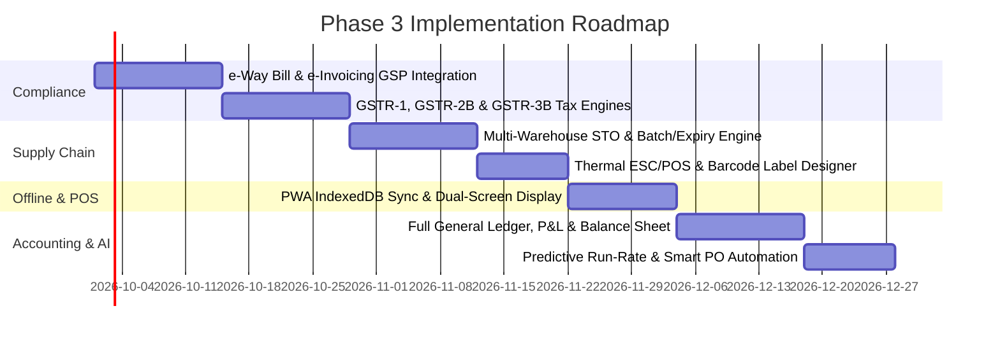

# BillingAnytime — Phase 3 Master Technical & Functional Specification

> **Status:** APPROVED FOR PLANNING & ARCHITECTURAL BASELINE  
> **Target Version:** v3.0.0-PROD  
> **Prerequisites:** Phase 1 (Multi-Tenant Auth & Role Engine) + Phase 2 (Paise-Precision Financial Engine, POS Fast Billing, WAC Inventory, Double-Sided Party Ledgers)

---

## Executive Overview & Architectural North Star

Phase 3 transitions **BillingAnytime** from an operational billing and inventory system into an **Enterprise ERP & Compliance Powerhouse**. It expands regulatory automation, multi-location supply chain logistics, offline POS resilience, deep financial accounting, and predictive inventory intelligence.

---

## 1. Compliance & Government Integrations (GSP / NIC)

### 1.1 e-Way Bill Direct Generation
- **Scope**: Automated payload generation and direct GSP dispatch for shipments $> ₹50,000$ (or state-specific threshold).
- **Architecture**:
  - `EWayBillService`: Generates Part A (GSTIN of Supplier/Recipient, Place of Delivery, HSN, Taxable & Tax amounts) and Part B (Vehicle Number, Transporter ID/Doc No).
  - Webhook listener for real-time status updates and cancellation callbacks within 24 hours.
  - Thermal and A4 printable format with embedded NIC Barcode.

### 1.2 e-Invoicing (IRN & Signed QR Code)
- **Scope**: Direct B2B electronic invoice registration via IRP (Invoice Registration Portal).
- **Features**:
  - Automatic JSON schema generation adhering to standard GST INV-01 format.
  - IRN (Invoice Reference Number) generation, digital signature verification, and 500x500 signed QR code generation.
  - Automatic fallback queue for retry on portal downtime.

### 1.3 GST Return Preparation & Reconciliation Engine
- **GSTR-1**: Live generation of B2B, B2CL, B2CS, CDNR, and HSN summary JSON exports ready for GST portal upload.
- **GSTR-2B Auto-Reconciliation**: Matching inward purchase bills with GSTR-2B JSON downloads to flag missing supplier invoices, rate mismatches, and ineligible Input Tax Credit (ITC).
- **GSTR-3B Computation**: Live tax liability vs available ITC offset calculator with cash ledger balance forecast.

---

## 2. Multi-Branch & Multi-Warehouse Supply Chain

### 2.1 Stock Transfer Orders (STO)
- **Workflow**:
  1. Transfer Request initiated by Destination Warehouse.
  2. Stock Dispatch posted by Source Warehouse: Outward transfer recorded, stock moved into `IN_TRANSIT` virtual bucket.
  3. Goods Receipt Note (GRN) confirmed at Destination: Stock moved from `IN_TRANSIT` to active available balance.
  4. Discrepancy & Transit Loss accounting: Immediate write-off posting with audit trail.

### 2.2 Warehouse Zones, Racks & Batch/Expiry Tracking
- Granular bin/rack mapping for warehouse picking optimization.
- FIFO/FEFO (First-Expired-First-Out) batch selection for pharmaceutical and FMCG businesses.
- Near-expiry stock alerts and liquidation discounting engine.

---

## 3. Hardware & POS Thermal Printing Engine

### 3.1 Direct ESC/POS Driver & Print Engine
- Native support for 58mm (2-inch) and 80mm (3-inch) thermal receipt printers via WebUSB, WebBluetooth, and Network IP raw sockets.
- Customizable thermal receipt layout: Store logo header, GSTIN summary, itemized discount breakdown, loyalty points, and UPI dynamic payment QR.

### 3.2 Visual Barcode & Label Designer
- Drag-and-drop label designer with support for:
  - 1D Barcodes: EAN-13, Code-128, UPC-A.
  - 2D Barcodes: QR Code, Data Matrix.
  - Label dimensions: 50x25mm, 38x25mm, 100x50mm, and custom multi-column rolls.
  - Variable fields: Product Name, SKU, MRP, Selling Price, Batch, Expiry, FSSAI / Mfg License.

### 3.3 Dual-Screen Customer Facing Display (CFD)
- Secondary monitor support for POS lanes: Real-time itemized basket tally, applied discounts, total savings badge, and dynamic UPI QR payment screen.

---

## 4. Offline PWA & Conflict-Free Edge Sync

### 4.1 Local IndexedDB Fast Engine
- Stores catalog, barcode index, customer directory, and open fiscal sequence locally.
- Full offline POS checkout capability during internet or cloud disruption.

### 4.2 Background Sync Queue & Sequence Reconciliation
- Offline transactions assigned temporary client GUIDs (`OFFLINE_POS_xxxx`).
- Upon connection restore, Service Worker submits sync queue with cryptographic payload verification.
- Concurrency-safe monotonic server sequence assigned without altering chronological ledger integrity.

---

## 5. Enterprise Financial Accounting (MIS & General Ledger)

### 5.1 Authoritative Double-Entry General Ledger
- Complete Chart of Accounts: Assets, Liabilities, Equity, Revenue, Cost of Goods Sold, and Operating Expenses.
- Real-time Trial Balance derivation.
- Live Profit & Loss (P&L) Statement: Gross Margin, EBITDA, Operating Profit, and Net Profit.
- Live Balance Sheet with automated retained earnings roll-forward.

### 5.2 Receivables & Payables Aging Analysis
- Granular aging buckets: `0–30 Days`, `31–60 Days`, `61–90 Days`, `90+ Days`.
- Automated payment reminder dispatch via WhatsApp Business Cloud API & SMS.

### 5.3 Banking & Contra Transfers
- Multi-bank account tracking, cash drawer registers, and petty cash management.
- Contra transfers (Cash to Bank, Bank to Cash, Inter-Bank).
- Bank statement CSV / MT940 import and automated rule-based reconciliation.

---

## 6. Smart AI & Predictive Inventory Intelligence

### 6.1 Demand Forecasting & Run-Rate Analytics
- Moving average and exponential smoothing algorithms analyzing historical sales velocity.
- Predictive run-out date calculation per SKU taking into account supplier lead times.

### 6.2 Automated Purchase Order (PO) Recommendation
- Auto-generates draft Purchase Orders when stock reaches safety thresholds ($Stock \le ReorderLevel + LeadTimeBuffer$).
- Consolidates orders per vendor to optimize minimum order quantities (MOQ) and freight costs.

---

## Phase 3 Implementation Roadmap

